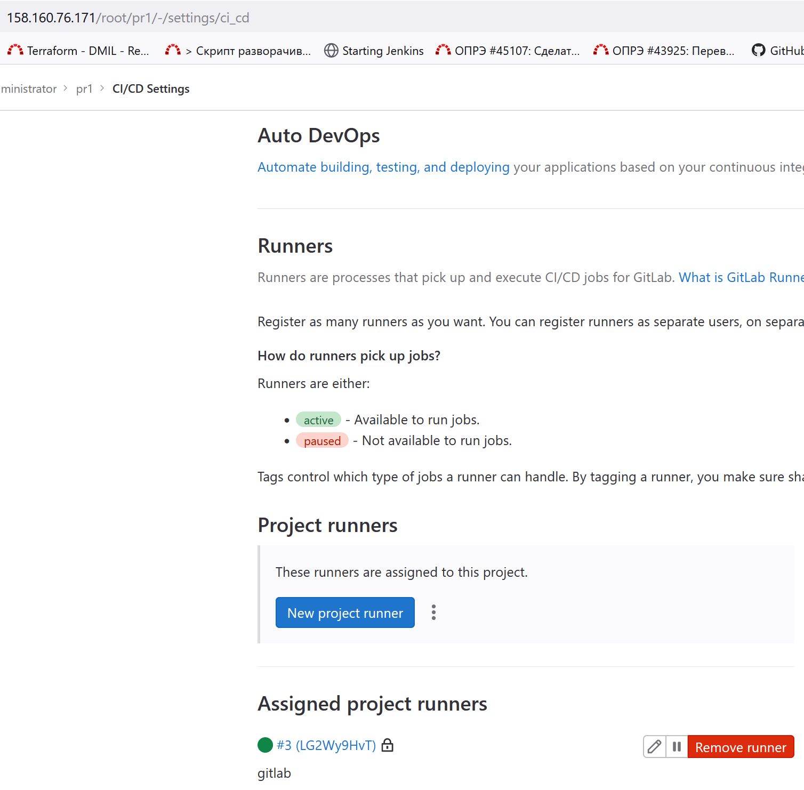

# Домашнее задание к занятию "`Gitlab`" - `Илларионов Дмитрий`

---

### Задание 1

**Что нужно сделать:**

1. Разверните GitLab локально, используя Vagrantfile и инструкцию, описанные в [этом репозитории](https://github.com/netology-code/sdvps-materials/tree/main/gitlab).   
2. Создайте новый проект и пустой репозиторий в нём.
3. Зарегистрируйте gitlab-runner для этого проекта и запустите его в режиме Docker. Раннер можно регистрировать и запускать на той же виртуальной машине, на которой запущен GitLab.

В качестве ответа в репозиторий шаблона с решением добавьте скриншоты с настройками раннера в проекте.



Код регистрации раннера:

```
root@gitlab:~#    docker run -ti --rm --name gitlab-runner \
   --net>      --network host \
>      -v /srv/gitlab-runner/config:/etc/gitlab-runner \
>      -v /var/run/docker.sock:/var/run/docker.sock \
>      gitlab/gitlab-runner:latest register
Runtime platform                                    arch=amd64 os=linux pid=6 revision=6e766faf version=16.4.0
Running in system-mode.

Enter the GitLab instance URL (for example, https://gitlab.com/):
http://158.160.76.171
Enter the registration token:
GR1348941**********bZpbYH9
Enter a description for the runner:
[gitlab]:
Enter tags for the runner (comma-separated):

Enter optional maintenance note for the runner:

WARNING: Support for registration tokens and runner parameters in the 'register' command has been deprecated in GitLab Runner 15.6 and will be replaced with support for authentication tokens. For more information, see https://docs.gitlab.com/ee/ci/runners/new_creation_workflow
Registering runner... succeeded                     runner=GR1348941TDyWDAv2
Enter an executor: kubernetes, docker, docker-autoscaler, instance, shell, ssh, virtualbox, docker+machine, custom, docker-windows, parallels:
docker
Enter the default Docker image (for example, ruby:2.7):
go:1.17
Runner registered successfully. Feel free to start it, but if it's running already the config should be automatically reloaded!

Configuration (with the authentication token) was saved in "/etc/gitlab-runner/config.toml"
```

Настройка конфига:

```
root@gitlab:~# ll /etc/gitlab-runner/
ls: cannot access '/etc/gitlab-runner/': No such file or directory
root@gitlab:~# cd /srv/gitlab-runner/config
root@gitlab:/srv/gitlab-runner/config# ll
total 16
drwxr-xr-x 2 root root 4096 Oct  7 09:17 ./
drwxr-xr-x 3 root root 4096 Oct  4 17:39 ../
-rw------- 1 root root  584 Oct  7 09:17 config.toml
-rw------- 1 root root   14 Oct  4 17:39 .runner_system_id
root@gitlab:/srv/gitlab-runner/config# nano config.toml
```

Конфиг:

```
root@gitlab:/srv/gitlab-runner/config# cat config.toml
concurrent = 1
check_interval = 0
shutdown_timeout = 0

[session_server]
  session_timeout = 1800

[[runners]]
  name = "gitlab"
  url = "http://158.160.76.171"
  id = 3
  token = "LG2Wy9HvTJSupUkg512z"
  token_obtained_at = 2023-10-07T09:16:05Z
  token_expires_at = 0001-01-01T00:00:00Z
  executor = "docker"
  [runners.cache]
    MaxUploadedArchiveSize = 0
  [runners.docker]
    tls_verify = false
    image = "go:1.17"
    privileged = false
    disable_entrypoint_overwrite = false
    oom_kill_disable = false
    disable_cache = false
#    volumes = ["/cache"]
    volumes = ["/cache", "/var/run/docker.sock:/var/run/docker.sock"]
    shm_size = 0
```

Запуск:

```
root@gitlab:/srv/gitlab-runner/config# docker ps -a
CONTAINER ID   IMAGE     COMMAND   CREATED   STATUS    PORTS     NAMES
root@gitlab:/srv/gitlab-runner/config#    docker run -d --name gitlab-runner --restart always \
>      --network host \
>      -v /srv/gitlab-runner/config:/etc/gitlab-runner \
>      -v /var/run/docker.sock:/var/run/docker.sock \
>      gitlab/gitlab-runner:latest
104a5c8e3fab68732b1b980902ce140c96f12f468257af5e8bda8006f14e387b
root@gitlab:/srv/gitlab-runner/config# docker ps -a
CONTAINER ID   IMAGE                         COMMAND                  CREATED         STATUS         PORTS     NAMES
104a5c8e3fab   gitlab/gitlab-runner:latest   "/usr/bin/dumb-init …"   4 seconds ago   Up 3 seconds             gitlab-runner
root@gitlab:/srv/gitlab-runner/config#
```


---

### Задание 2

**Что нужно сделать:**

1. Запушьте [репозиторий](https://github.com/netology-code/sdvps-materials/tree/main/gitlab) на GitLab, изменив origin. Это изучалось на занятии по Git.
2. Создайте .gitlab-ci.yml, описав в нём все необходимые, на ваш взгляд, этапы.

В качестве ответа в шаблон с решением добавьте: 
   
 * файл gitlab-ci.yml для своего проекта или вставьте код в соответствующее поле в шаблоне; 
 * скриншоты с успешно собранными сборками.
 
 
---
## Дополнительные задания* (со звёздочкой)

Их выполнение необязательное и не влияет на получение зачёта по домашнему заданию. Можете их решить, если хотите лучше разобраться в материале.

---

### Задание 3*

Измените CI так, чтобы:

 - этап сборки запускался сразу, не дожидаясь результатов тестов;
 - тесты запускались только при изменении файлов с расширением *.go.

В качестве ответа добавьте в шаблон с решением файл gitlab-ci.yml своего проекта или вставьте код в соответсвующее поле в шаблоне.
